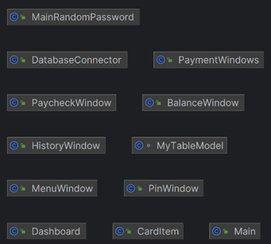
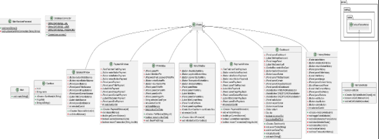
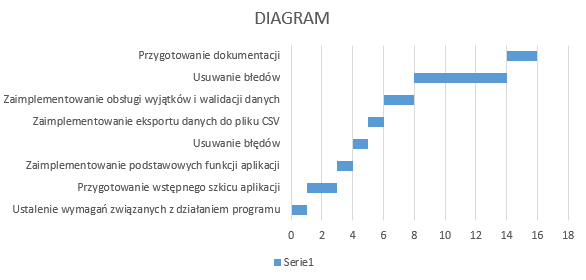
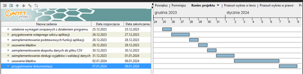
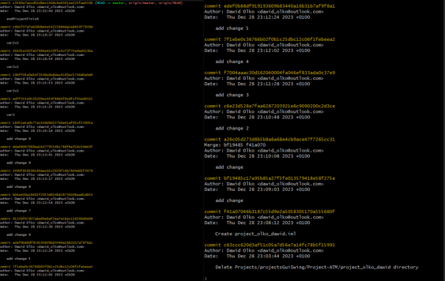

  
# Praca projektowa programowanie obiektowe
## System symulujący działanie Bankomatu

### Prowadzący:	mgr inż. Ewa Żesławska	
### Autor:Dawid Olko | nr albumu: 125148 |Kierunek: Informatyka, grupa lab 3
### Rzeszów 2024

## Spis treści
1. [Opis założeń projektu](#1-opis-założeń-projektu)
2. [Specyfikacja wymagań](#2-specyfikacja-wymagań)
3. [Opis struktury projektu](#3-opis-struktury-projektu)
4. [Harmonogram realizacji projektu (diagram Gantta)](#4-harmonogram-realizacji-projektu-diagram-gantta)
5. [Prezentacja warstwy użytkowej projektu](#5-prezentacja-warstwy-użytkowej-projektu)
6. [Podsumowanie](#6-podsumowanie)
7. [Literatura](#7-literatura)

 
## 1. Opis założeń projektu

W dzisiejszych czasach, gdy sektor bankowy ewoluuje z niespotykaną dotąd prędkością, napotykamy na wyzwania związane z adaptacją technologii i utrzymaniem wysokiej jakości obsługi klienta. Jednym z kluczowych elementów tego ekosystemu są bankomaty, stanowiące ważny punkt kontaktu z klientem. Niestety, wraz ze wzrostem złożoności operacji bankowych i rosnącymi oczekiwaniami klientów, bankomaty często stają się obiektem błędów operacyjnych, awarii, a nawet przestępczości. Te problemy, choć nie związane bezpośrednio z główną działalnością banku, mają istotny wpływ na wizerunek instytucji finansowej, satysfakcję klientów oraz efektywność operacyjną.

Opracowany **innowacyjny system symulacji pracy bankomatu**. Jest to narzędzie, które nie tylko pozwala na dokładne modelowanie i analizę różnorodnych scenariuszy działania bankomatów, ale także służy jako platforma szkoleniowa dla pracowników. Dzięki temu systemowi możliwe jest wykrywanie i zapobieganie potencjalnym problemom, a także optymalizacja procesów obsługi klienta.

Projekt **"Bankomat"** to kompleksowa aplikacja GUI, której celem jest symulacja operacji wykonywanych na rzeczywistym bankomacie. Zapewnia użytkownikom interfejs graficzny, za pośrednictwem którego mogą weryfikować tożsamość za pomocą karty elektronicznej i numeru PIN, a następnie przeprowadzać podstawowe operacje bankowe. Aplikacja obsługuje karty Visa, American Express, Visa Electron, Mastercard, Diners Club, Japan Credit Bureau.

Aplikacja jest zbudowana w oparciu o **Java Swing** w środowisku **IntelliJ IDEA** i wykorzystuje **MySQL** jako system zarządzania relacyjną bazą danych, co umożliwia przechowywanie i zarządzanie danymi w sposób strukturalny i bezpieczny. W szczególności, baza danych składa się z trzech głównych tabel relacyjnych:

- `stan_konta`: przechowuje informacje o stanie konta, w tym saldo każdej karty.
- `karty`: zawiera informacje o dostępnych kartach elektronicznych oraz przypisane do nich numery PIN.
- `tablehistory`: rejestruje historię transakcji, w tym typ operacji, kwotę oraz datę transakcji.

Każda interakcja z użytkownikiem jest weryfikowana przez system sprawdzając zgodność wprowadzonych numerów PIN z tymi przechowywanymi w tabeli `karty`. Po pomyślnej autoryzacji użytkownik ma dostęp do funkcji bankomatu takich jak sprawdzenie salda, wypłata i wpłata gotówki oraz przegląd historii transakcji.

Dodatkowo, aplikacja oferuje unikalne funkcje dla poprawy doświadczenia użytkownika:

- Możliwość regulacji poziomu głośności tła muzycznego, co jest rzadkością w tradycyjnych bankomatach, jednak znacząco podnosi komfort użytkowania aplikacji.
- Funkcjonalność eksportu i importu danych bazy danych, co umożliwia łatwe przenoszenie stanu aplikacji między różnymi środowiskami lub szybkie przywracanie systemu do stanu poprzedniego.

Każda z tych funkcji jest zaimplementowana z myślą o maksymalnej wygodzie i intuicyjności obsługi, co jest wspierane przez przejrzysty i responsywny interfejs użytkownika stworzony przy użyciu Java Swing. Projekt "Bankomat" jest nie tylko demonstracją umiejętności programistycznych, ale także próbą innowacji w zakresie interakcji człowieka z automatyzowanymi systemami bankowymi.

### Cele i założenia projektu

1. **Cel projektu**: Zaprojektowano system symulacji pracy bankomatu, który ma na celu nie tylko edukację i trening pracowników banków, ale również testowanie i optymalizację rzeczywistego działania bankomatów.
2. **Problem i jego źródło**: Rozwiązany zostanie problem związany z ograniczonym dostępem do praktycznego szkolenia z zakresu obsługi bankomatów. Podstawowym źródłem problemu jest brak odpowiednich narzędzi symulacyjnych, które w bezpiecznym środowisku oddają realia pracy tych urządzeń.
3. **Ważność problemu i dowody**: Brak praktycznych narzędzi szkoleniowych prowadzi do zwiększenia ryzyka błędów operacyjnych i oszustw, co potwierdzają raporty dotyczące błędów obsługi bankomatów przez nowo zatrudniony personel.
4. **Co jest niezbędne do rozwiązania problemu**: Niezbędne jest stworzenie interaktywnej aplikacji symulującej pracę bankomatu, która umożliwi praktyczne szkolenie pracowników oraz testowanie nowych funkcji bez ryzyka finansowego.
5. **Sposób rozwiązania problemu**: Problem zostanie rozwiązany poprzez etapowy rozwój oprogramowania, rozpoczynając od projektu interfejsu użytkownika, a kończąc na integracji z rzeczywistymi systemami bankowymi. Wynikiem prac będzie aplikacja pozwalająca na symulację różnych scenariuszy użytkowania bankomatu.
6. **Założenia do projektu**: W projekcie założono, że aplikacja będzie elastyczna i skalowalna, umożliwiająca ciągłe dodawanie nowych funkcjonalności oraz łatwe adaptacje do zmieniających się wymagań bankowości cyfrowej.

## 2. Specyfikacja wymagań

### 2.1. Wymagania funkcjonalne

- **Autentykacja Użytkownika:**
  - Weryfikacja posiadacza karty na podstawie numeru PIN zapisanego w bazie danych.
  - Blokada karty po trzech nieudanych próbach wprowadzenia PIN.

- **Obsługa różnych typów kart:**
  - Akceptacja wielu typów kart bankowych, w tym Visa, Mastercard, American Express, Visa Electron, Diners Club i Japan Credit Bureau.
  - Dynamiczne rozpoznawanie typu karty na podstawie danych wprowadzonych przez użytkownika.

- **Operacje na koncie:**
  - Sprawdzenie salda konta z wykorzystaniem informacji z tabeli `stan_konta`.
  - Wypłata gotówki z aktualizacją salda w bazie danych.
  - Wpłata gotówki z aktualizacją salda w bazie danych.
  - Wyświetlanie historii transakcji, korzystając z danych z tabeli `tablehistory`.

- **Zarządzanie danymi:**
  - Eksport danych z bazy do pliku, co umożliwia łatwe przywracanie i przenoszenie danych.
  - Import danych do bazy z pliku, co pozwala na przywracanie stanu aplikacji.

- **Bezpieczeństwo:**
  - Szyfrowanie danych wrażliwych podczas transmisji między aplikacją a bazą danych.
  - Mechanizmy zapobiegające atakom, z zastosowaniem `passwordField` dla ukrycia PIN.

- **Uwierzytelnianie Użytkownika:**
  - System musi umożliwić autoryzację użytkownika za pomocą karty bankowej i kodu PIN.

- **Transakcje Finansowe:**
  - Bankomat powinien obsługiwać podstawowe operacje bankowe, takie jak wypłata gotówki, sprawdzanie salda, wpłata gotówki oraz zapisywanie potwierdzenia transakcji w bazie.

- **Bezpieczeństwo i Audyt:**
  - Powinna być możliwość śledzenia wszystkich operacji na bankomacie oraz zapewnienie zgodności z wymogami bezpieczeństwa.

- **Interfejs użytkownika:**
  - Wyświetlanie komunikatów o błędach i potwierdzeniach operacji.
  - Nawigacja między ekranami aplikacji za pomocą przycisków i menu.

### 2.2. Wymagania niefunkcjonalne

- **Wydajność:**
  - Szybka i efektywna odpowiedź na zapytania użytkownika bez długich oczekiwań.
  - Optymalizacja zapytań do bazy danych dla zapewnienia płynności działania.

- **Użyteczność:**
  - Intuicyjny interfejs użytkownika, który jest łatwy w nawigacji nawet dla osób niezaznajomionych z technologią.
  - Czytelna i estetyczna prezentacja informacji.

- **Skalowalność:**
  - Łatwość w dodawaniu nowych funkcji i obsługi większej liczby użytkowników bez degradacji wydajności.

- **Dostępność:**
  - Aplikacja musi być dostępna bez błędów na wspieranych systemach operacyjnych.
  - Mechanizmy odzyskiwania po awarii w celu minimalizacji przestojów.

- **Modułowość:**
  - Struktura aplikacji podzielona na moduły, co ułatwia zarządzanie kodem i wprowadzanie zmian.

- **Nieprzerwana Dostępność:**
  - Bankomat powinien być dostępny 24/7/365, z minimalnym czasem przestoju.

- **Bezpieczeństwo:**
  - Musi zawierać zaawansowane mechanizmy szyfrowania i autoryzacji dwuskładnikowej, aby zapewnić bezpieczeństwo transakcji.

- **Testowalność:**
  - Możliwość przeprowadzenia pełnej gamy testów (jednostkowych, integracyjnych, systemowych, akceptacyjnych) w celu zapewnienia jakości i niezawodności.
 
# 3. Opis struktury projektu

## 3.1. Wykorzystywany język i narzędzia

- **Java JDK**: Zalecana wersja: Java Development Kit (JDK) 17 – Jest to najnowsza długoterminowa wersja wsparcia (LTS), która zapewnia stabilność i szeroki zakres funkcji, w tym poprawki bezpieczeństwa i wydajności.

- **Środowisko programistyczne**: IntelliJ IDEA Najnowsza stabilna wersja: IntelliJ IDEA 2022.1 – Zawiera ulepszenia wydajności, lepsze wsparcie dla najnowszych wersji Javy, jak również zaawansowane narzędzia do analizy kodu i faktoryzacji.

- **GUI Toolkit**: Swing Użyta w projekcie wersja Swing jest zintegrowana z JDK, dlatego zaleca się użycie tej samej wersji JDK dla kompatybilności.

- **Baza danych**: MySQL Zalecana wersja: MySQL 8.0 – Oferuje ulepszone mechanizmy bezpieczeństwa, wydajności i wsparcie dla nowych funkcji SQL.

- **MySQL Connector/J**: Zalecana wersja: MySQL Connector/J 8.0.28 – Jest to zgodny sterownik JDBC dla wersji MySQL 8.0, który zapewnia wysoką wydajność połączeń z bazą danych.

- **Środowisko deweloperskie**: IntelliJ IDEA

## 3.2. Język programowania

Java to język programowania wysokiego poziomu, który charakteryzuje się silnym typowaniem, obiektowością i przenośnością kodu między różnymi platformami. Jest to język wyboru dla wielu aplikacji biznesowych i korporacyjnych ze względu na jego stabilność, dojrzałość i szerokie wsparcie społeczności. W projekcie „Bankomat” Java jest używana do tworzenia logiki biznesowej aplikacji, obsługi zdarzeń interfejsu użytkownika oraz komunikacji z bazą danych.

## 3.3. Biblioteki GUI

Swing to biblioteka do tworzenia graficznego interfejsu użytkownika (GUI) dla aplikacji Java. Oferuje bogaty zestaw komponentów, takich jak okna, przyciski, pola tekstowe, listy rozwijane i inne, które można łatwo dostosować i stylizować. Swing jest używany w projekcie do stworzenia responsywnego i intuicyjnego interfejsu, który umożliwia użytkownikom łatwą i bezproblemową interakcję z funkcjami bankomatu.

## 3.4. Sposób komunikacji z bazą danych

MySQL Connector/J to sterownik JDBC, który umożliwia aplikacjom Java komunikację z bazą danych MySQL. Jest to most między logiką aplikacji a bazą danych, pozwalający na wykonywanie zapytań SQL, aktualizowanie danych i odbieranie wyników. W projekcie jest wykorzystany do zarządzania transakcjami bankowymi, autentykacji użytkowników i przechowywania historii operacji. Użycie MySQL Connector/J zapewnia wydajne i bezpieczne zarządzanie danymi, co jest kluczowe dla operacji bankowych.

## 3.5. Powiązane narzędzia

Każdy z tych elementów technicznych został wybrany w celu zapewnienia niezawodności, wydajności i bezpieczeństwa aplikacji "Bankomat". Język Java w połączeniu z IDE IntelliJ IDEA oferuje solidną platformę programistyczną, a Swing i MySQL Connector/J dostarczają niezbędnych narzędzi do stworzenia funkcjonalnego i bezpiecznego systemu bankowego.

## 3.6. Diagram klas

  
   

Struktury przedstawione na diagramach odnoszą się do architektury oprogramowania symulacji bankomatu. Zawierają one klasy i okna reprezentujące różne aspekty systemu:

1. **Main**: Główna klasa inicjująca działanie aplikacji.
2. **DatabaseConnector**: Odpowiada za połączenie z bazą danych.
3. **CardItem**: Reprezentuje kartę bankową z jej podstawowymi atrybutami.
4. **MainRandomPassword**: Może być klasą generującą losowe hasła lub PINy.
5. **Dashboard**: Interfejs użytkownika prezentujący główne funkcje bankomatu.
6. **MenuWindow**: Okno menu oferujące różne opcje użytkownika.
7. **PinWindow**: Interfejs dla użytkownika do wprowadzania PINu.
8. **BalanceWindow**: Okno wyświetlające saldo dostępne na koncie użytkownika.
9. **PaymentWindows**: Okno umożliwiające realizację płatności.
10. **PaycheckWindow**: Okno do zarządzania czekami i wypłatami.
11. **HistoryWindow**: Okno wyświetlające historię transakcji.
12. **MyTableModel**: Może być klasą dostosowującą dane do wyświetlenia w tabelach.

Każda klasa i okno zawierają metody i atrybuty odpowiadające za specyficzne zachowanie lub prezentację danych w aplikacji. Na przykład, w klasie „PaymentWindows” znajdują się metody do zarządzania płatnościami, jak „depositMoney()” czy „updateBalance()”, natomiast „HistoryWindow” zarządza wyświetlaniem historii transakcji z użyciem metod takich jak „loadTransactionHistory()”. Diagram wskazuje na modularną i obiektową budowę systemu, gdzie każdy komponent jest odpowiedzialny za odizolowany zestaw funkcjonalności.

# 4. Harmonogram realizacji projektu (diagram Gantta)

Poniżej zamieszono harmonogram realizacji projektu.

  
   

Obydwa diagramy Gantta przedstawiają harmonogram realizacji projektu, zaznaczając kluczowe etapy prac oraz ich daty rozpoczęcia i zakończenia. Pierwszy diagram wskazuje na procesy takie jak przygotowanie dokumentacji, usuwanie błędów, implementację eksportu danych do pliku CSV, a także przygotowanie wstępnego szkicu aplikacji. Drugi diagram pokazuje plan prac na poszczególne dni miesiąca i wyraźnie dzieli działania na kolejne etapy.

Trudności i problemy pojawiły się w przypadku obsługi wyjątków i walidacji danych, gdzie widać zwiększoną alokację czasu na te działania. Wymagało to szczególnego skupienia na szczegółach i testowaniu, aby zapewnić poprawność działania aplikacji. Ponadto, istotną część projektu stanowiło przygotowanie dokumentacji, co sugeruje, że duży nacisk kładziono na dokładne opisanie specyfikacji i funkcjonalności systemu.

Projekt realizowany był z wykorzystaniem systemu kontroli wersji Git, wszystkie pliki źródłowe projektu znajdują się pod adresem: [https://github.com/dawidolko/java-ATM-system.git](https://github.com/dawidolko/java-ATM-system.git) i będą dostępne do 31.01.2025.

  
 
# 5. Podsumowanie

Opracowanie aplikacji GUI: Stworzono zaawansowaną aplikację z graficznym interfejsem użytkownika, która naśladuje działanie rzeczywistego bankomatu. Interfejs został zaprojektowany tak, aby był intuicyjny i łatwy w obsłudze, co umożliwia użytkownikom wykonywanie różnych operacji bankowych w sposób, który odzwierciedla rzeczywiste doświadczenia z bankomatem.

Wykorzystanie Java Swing i MySQL: Aplikacja została zbudowana w środowisku Java Swing, co zapewnia stabilność i efektywność działania. Zastosowanie MySQL do zarządzania bazą danych gwarantuje bezpieczeństwo i integralność danych, co jest kluczowe w symulacji operacji bankowych.

Implementacja funkcji bankowych: Zaimplementowano podstawowe funkcje bankomatu, takie jak weryfikacja PIN, sprawdzanie salda, realizacja wypłat i wpłat gotówki oraz przeglądanie historii transakcji. Te funkcje zapewniają realistyczne doświadczenie korzystania z bankomatu, co jest niezbędne w szkoleniach i edukacji pracowników banków.

Dodatkowe funkcje dla użytkownika: Wprowadzono unikalne funkcje, takie jak regulacja głośności i możliwość eksportu/importu danych bazy, co zwiększa funkcjonalność aplikacji i poprawia doświadczenie użytkownika.

Planowany rozwój funkcjonalności: Projekt przewiduje rozszerzenie funkcjonalności o nowe opcje bankowe i usprawnienia związane z bezpieczeństwem. Planowane jest także ulepszenie interfejsu użytkownika, aby był jeszcze bardziej intuicyjny i dostępny.

Integracja z systemami bankowymi i testowanie: Planuje się integrację z dodatkowymi systemami bankowymi, co pozwoli na szersze wykorzystanie aplikacji w rzeczywistym środowisku bankowym. Rozbudowa możliwości testowania aplikacji pozwoli na lepsze przygotowanie do rzeczywistych scenariuszy funkcjonowania bankomatów.

Zaawansowane techniki szyfrowania i zabezpieczeń: W celu ochrony danych użytkowników, planowane jest wdrożenie zaawansowanych technik szyfrowania i zabezpieczeń, co jest kluczowe w kontekście ochrony informacji finansowych i osobowych.

## 5.1. Dalsze planowane prace rozwojowe projektu obejmują:

1. Integracja z mobilnymi systemami płatności: Rozszerzenie funkcjonalności bankomatu o obsługę płatności zbliżeniowych i mobilnych, co zwiększy dostępność i wygodę dla użytkowników.

2. Zastosowanie uczenia maszynowego do profilowania ryzyka: Implementacja algorytmów uczenia maszynowego w celu wykrywania podejrzanych transakcji i zapobiegania oszustwom.

3. Rozbudowa interfejsu użytkownika: Modernizacja UI/UX, aby była bardziej intuicyjna i przyjazna dla użytkownika, potencjalnie z wykorzystaniem technologii dotykowych i graficznych.

4. Wprowadzenie funkcji personalizacji: Pozwolenie użytkownikom na dostosowanie interfejsu bankomatu do indywidualnych preferencji, np. wybór języka czy wyglądu ekranu.

5. Zwiększenie interaktywności: Dodanie interaktywnych tutoriali pomagających nowym użytkownikom w nauczeniu się obsługi bankomatu.

6. Bezpieczeństwo cybernetyczne: Wzmocnienie zabezpieczeń przez wprowadzenie nowoczesnych rozwiązań kryptograficznych i multi-faktorowej autentykacji.

7. Ekspansja na nowe rynki: Dostosowanie oprogramowania do wymagań i specyfikacji różnych krajów i instytucji finansowych, co pozwoli na globalne wdrożenie systemu.

8. Wdrażanie aktualizacji: Regularne aktualizacje oprogramowania w celu wprowadzania nowych funkcji i utrzymania zgodności z najnowszymi standardami branżowymi.

Każdy z tych punktów można by dalej rozwijać, uwzględniając specyficzne wymagania i cele projektu.

# 6. Literatura

W celu zgłębienia wiedzy na temat systemów bankomatów oraz ogólnie systemów transakcyjnych, można sięgnąć do następujących źródeł:

## 6.1. Książki i Podręczniki

1. "Bank 3.0: Why Banking Is No Longer Somewhere You Go But Something You Do" - Brett King. Książka ta dostarcza wglądu w zmiany technologiczne w bankowości i przyszłość transakcji finansowych.

2. "The ATM and the Internet of Things" - Richard P. Smyth. Pozycja ta omawia rozwój bankomatów w kontekście rosnącej sieci urządzeń połączonych przez Internet.

3. "Designing the Digital Experience: How to Use EXPERIENCE DESIGN Tools & Techniques to Build Websites Customers Love" - David Lee King. Ta książka jest przydatna do zrozumienia jak projektować przyjazne użytkownikowi interfejsy dla aplikacji bankowych.

## 6.2. Artykuły

1. "How ATMs Work" - Artykuł w czasopiśmie "How Stuff Works", który szczegółowo wyjaśnia działanie bankomatów.

2. "The Evolution of Automated Teller Machines" - Artykuł naukowy omawiający historię i rozwój bankomatów.

## 7.3. Linki do Stron WWW

1. [Official Documentation of Java Platform, Standard Ed.](https://docs.oracle.com/javase/8/docs/api/) - Dokumentacja Java SE dostarcza informacji na temat używania języka Java, który jest często wykorzystywany do tworzenia aplikacji bankomatów.

2. [Stack Overflow](https://stackoverflow.blog) - Społeczność programistów, gdzie można znaleźć odpowiedzi na wiele pytań związanych z problemami programistycznymi, w tym związanymi z tworzeniem oprogramowania bankowego.

3. [GitHub](https://github.com/) - Na tej platformie można znaleźć projekty open-source związane z systemami bankomatów, które mogą służyć jako przykład lub punkt wyjścia dla własnych projektów.

Korzystanie z wymienionych źródeł znacząco wzbogaciło moją wiedzę na temat systemów bankomatów, ich bezpieczeństwa, interfejsu użytkownika oraz najlepszych praktyk w tworzeniu oprogramowania w tej dziedzinie.

