# Object-Oriented Programming Project Work

## ATM Operation Simulation System

### Supervisor: MSc. Eng. Ewa Żesławska

### Author: Dawid Olko | Student ID: 125148 | Field of study: Computer Science, lab group 3

### Rzeszów 2024

## Table of Contents

1. [Project Assumptions Description](#1-project-assumptions-description)
2. [Requirements Specification](#2-requirements-specification)
3. [Project Structure Description](#3-project-structure-description)
4. [Project Implementation Schedule (Gantt Chart)](#4-project-implementation-schedule-gantt-chart)
5. [Presentation of the Project's User Interface Layer](#5-presentation-of-the-projects-user-interface-layer)
6. [Summary](#6-summary)
7. [Literature](#7-literature)

# 1. Project Assumptions Description

In today's era, as the banking sector evolves with unprecedented speed, we encounter challenges related to technology adaptation and maintaining high-quality customer service. One of the key elements of this ecosystem is ATMs, which constitute an important point of contact with the customer. Unfortunately, with the increase in banking operations' complexity and growing customer expectations, ATMs often become the object of operational errors, failures, and even criminal activity. These problems, although not directly related to the bank's main activity, significantly affect the financial institution's image, customer satisfaction, and operational efficiency.

Developed **an innovative ATM operation simulation system**. This tool not only allows for precise modeling and analysis of various ATM operation scenarios but also serves as a training platform for employees. Thanks to this system, it is possible to detect and prevent potential problems, as well as optimize customer service processes.

The project **"ATM"** is a comprehensive GUI application aimed at simulating operations performed on a real ATM. It provides users with a graphical interface, through which they can verify identity using an electronic card and PIN number, and then perform basic banking operations. The application supports Visa, American Express, Visa Electron, Mastercard, Diners Club, Japan Credit Bureau cards.

The application is built on **Java Swing** in the **IntelliJ IDEA** environment and uses **MySQL** as a relational database management system, allowing for structured and secure data storage and management. Specifically, the database consists of three main relational tables:

- `account_status`: stores information about account status, including the balance of each card.
- `cards`: contains information about available electronic cards and their assigned PIN numbers.
- `tablehistory`: records the transaction history, including the type of operation, amount, and transaction date.

Each user interaction is verified by the system by checking the entered PIN numbers against those stored in the `cards` table. Upon successful authorization, the user has access to ATM functions such as checking the balance, cash withdrawal and deposit, and viewing transaction history.

Additionally, the application offers unique features to improve user experience:

- The ability to adjust the background music volume, which is a rarity in traditional ATMs, but significantly enhances the comfort of using the application.
- Functionality for exporting and importing database data, allowing for easy transfer of the application's state between different environments or quick system restoration to a previous state.

Each of these features is implemented with maximum convenience and intuitiveness in mind, supported by a clear and responsive user interface created using Java Swing. The "ATM" project is not only a demonstration of programming skills but also an attempt at innovation in the interaction between humans and automated banking systems.

### Project Goals and Assumptions

1. **Project goal**: Design an ATM operation simulation system intended not only for educating and training bank employees but also for testing and optimizing the actual operation of ATMs.
2. **Problem and its source**: The problem related to the limited access to practical training in ATM operation will be addressed. The primary source of the problem is the lack of appropriate simulation tools that safely replicate the realities of these devices' work.
3. **Importance of the problem and evidence**: The lack of practical training tools leads to an increase in the risk of operational errors and fraud, as confirmed by reports on ATM handling errors by newly hired personnel.
4. **What is necessary to solve the problem**: It is necessary to create an interactive application simulating ATM work, which will enable practical training of employees and testing of new functions without financial risk.
5. **How the problem will be solved**: The problem will be solved through the phased development of software, starting from the design of the user interface and ending with integration with real banking systems. The result will be an application allowing for the simulation of various ATM usage scenarios.
6. **Assumptions for the project**: The project assumes that the application will be flexible and scalable, allowing for continuous addition of new functionalities and easy adaptations to the changing requirements of digital banking.

## 2. Requirements Specification

### 2.1. Functional Requirements

- **User Authentication:**

  - Verification of the cardholder based on the PIN number stored in the database.
  - Card lockout after three unsuccessful PIN entry attempts.

- **Support for Different Types of Cards:**

  - Acceptance of various types of bank cards, including Visa, Mastercard, American Express, Visa Electron, Diners Club, and Japan Credit Bureau.
  - Dynamic recognition of card type based on user-entered data.

- **Account Operations:**

  - Checking the account balance using information from the `account_status` table.
  - Cash withdrawal with balance update in the database.
  - Cash deposit with balance update in the database.
  - Displaying transaction history, using data from the `tablehistory` table.

- **Data Management:**

  - Exporting data from the database to a file, allowing for easy restoration and data transfer.
  - Importing data into the database from a file, facilitating application state restoration.

- **Security:**

  - Encryption of sensitive data during transmission between the application and the database.
  - Mechanisms to prevent attacks, employing `passwordField` to conceal the PIN.

- **User Authentication:**

  - The system must enable user authorization using a bank card and PIN code.

- **Financial Transactions:**

  - The ATM should support basic banking operations such as cash withdrawal, balance checking, cash deposit, and recording transaction confirmation in the database.

- **Security and Audit:**

  - There should be the ability to track all operations on the ATM and ensure compliance with security requirements.

- **User Interface:**
  - Displaying error messages and operation confirmations.
  - Navigation between application screens using buttons and menus.

### 2.2. Non-Functional Requirements

- **Performance:**

  - Quick and efficient response to user queries without long waiting times.
  - Optimization of database queries to ensure smooth operation.

- **Usability:**

  - An intuitive user interface that is easy to navigate even for those unfamiliar with technology.
  - Clear and aesthetically pleasing presentation of information.

- **Scalability:**

  - Ease of adding new features and handling a larger number of users without performance degradation.

- **Availability:**

  - The application must be error-free on supported operating systems.
  - Recovery mechanisms to minimize downtime.

- **Modularity:**

  - Application structure divided into modules, facilitating code management and changes.

- **Continuous Availability:**

  - The ATM should be available 24/7/365, with minimal downtime.

- **Security:**

  - Must include advanced encryption mechanisms and two-factor authentication to ensure the security of transactions.

- **Testability:**
  - The ability to conduct a full range of tests (unit, integration, system, acceptance) to ensure quality and reliability.

# 3. Project Structure Description

## 3.1. Language and Tools Used

- **Java JDK**: Recommended version: Java Development Kit (JDK) 17 – This is the latest Long-Term Support (LTS) version, offering stability and a wide range of features, including security and performance enhancements.

- **Development Environment**: IntelliJ IDEA Latest stable version: IntelliJ IDEA 2022.1 – Features performance improvements, better support for the latest versions of Java, as well as advanced code analysis and refactoring tools.

- **GUI Toolkit**: Swing The version of Swing used in the project is integrated with JDK, so using the same version of JDK for compatibility is recommended.

- **Database**: MySQL Recommended version: MySQL 8.0 – Offers improved security mechanisms, performance, and support for new SQL features.

- **MySQL Connector/J**: Recommended version: MySQL Connector/J 8.0.28 – This is a compatible JDBC driver for MySQL version 8.0, providing high-performance database connections.

- **Development Environment**: IntelliJ IDEA

## 3.2. Programming Language

Java is a high-level programming language characterized by strong typing, object orientation, and code portability across different platforms. It is the language of choice for many business and corporate applications due to its stability, maturity, and broad community support. In the "ATM" project, Java is used to create the application's business logic, handle user interface events, and communicate with the database.

## 3.3. GUI Libraries

Swing is a library for creating a graphical user interface (GUI) for Java applications. It offers a rich set of components, such as windows, buttons, text fields, drop-down lists, and others, which can be easily customized and styled. Swing is used in the project to create a responsive and intuitive interface that enables users to interact easily and seamlessly with the ATM's functions.

## 3.4. Database Communication Method

MySQL Connector/J is a JDBC driver that enables Java applications to communicate with the MySQL database. It serves as a bridge between the application logic and the database, allowing for the execution of

SQL queries, updating data, and receiving results. In the project, it is used to manage banking transactions, authenticate users, and store operation history. Using MySQL Connector/J ensures efficient and secure data management, which is crucial for banking operations.

## 3.5. Related Tools

Each of these technical elements was chosen to ensure the reliability, performance, and security of the "ATM" application. Java, in combination with the IntelliJ IDEA IDE, offers a robust development platform, while Swing and MySQL Connector/J provide the necessary tools to create a functional and secure banking system.

## 3.6. Class Diagram

The structures presented in the diagrams relate to the software architecture of the ATM simulation. They include classes and windows representing different aspects of the system:

1. **Main**: The main class initiating the application's operation.
2. **DatabaseConnector**: Responsible for connecting to the database.
3. **CardItem**: Represents a bank card with its basic attributes.
4. **MainRandomPassword**: Could be a class generating random passwords or PINs.
5. **Dashboard**: The user interface presenting the main functions of the ATM.
6. **MenuWindow**: The menu window offering various user options.
7. **PinWindow**: The interface for the user to enter the PIN.
8. **BalanceWindow**: The window displaying the user's account balance.
9. **PaymentWindows**: The window for making payments.
10. **PaycheckWindow**: The window for managing checks and withdrawals.
11. **HistoryWindow**: The window displaying transaction history.
12. **MyTableModel**: Could be a class adapting data for display in tables.

Each class and window contain methods and attributes responsible for specific behavior or data presentation in the application. For example, in the "PaymentWindows" class, there are methods for managing payments, like "depositMoney()" and "updateBalance()", whereas "HistoryWindow" manages displaying transaction history using methods such as "loadTransactionHistory()". The diagram indicates a modular and object-oriented structure of the system, where each component is responsible for a distinct set of functionalities.

# 4. Project Implementation Schedule (Gantt Chart)

Below is the project implementation schedule.

Both Gantt charts show the project implementation schedule, marking key work stages and their start and end dates. The first diagram indicates processes such as preparing documentation, debugging, implementing data export to CSV file, and preparing the initial draft of the application. The second diagram shows the work plan for individual days of the month and clearly divides activities into successive stages.

Challenges and problems arose in handling exceptions and data validation, where increased time allocation for these activities is visible. This required particular attention to details and testing to ensure the application's correct operation. Moreover, a significant part of the project involved preparing documentation, suggesting that considerable emphasis was placed on accurately describing the system's specifications and functionalities.

The project was carried out using the Git version control system, all project source files are located at: [https://github.com/dawidolko/java-ATM-system.git](https://github.com/dawidolko/java-ATM-system.git) and will be available until 01.31.2025.

# 5. Presentation of the Project's User Interface Layer

The "ATM" program operates once all classes are connected with the tables from the database, which we connect using SQL and JDBC through SQL-Connector-j-8.2.0.jar. To do this, we need to download the JAR file from the [https://dev.mysql.com/downloads/connector/j/](https://dev.mysql.com/downloads/connector/j/) page. Let's choose the platform according to the drawing below.

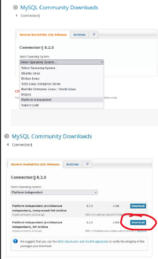

Once downloaded, it must be uploaded to the IntelliJ IDEA project. After completing this step, let's go to the project settings by clicking FILE -> Project Structure, and then proceed according to the picture below.

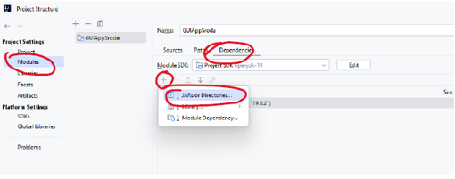

Then, transfer the downloaded file to the project folder, as shown in the picture below.

Once this has been done, we create a database using xampp, which can be downloaded from the Internet at this link [https://www.apachefriends.org/pl/index.html](https://www.apachefriends.org/pl/index.html). After installing and launching xampp, let's activate the Apache and MySQL modules, as shown in the picture below.

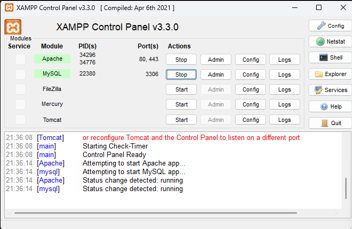

After connecting and launching the Apache and MySQL ports, let's connect to the browser at the address: [http://localhost/phpmyadmin](http://localhost/phpmyadmin), which will automatically transfer us to our local server. There, by clicking the "New" tab, we create a new database named "atm", which is important because the program will not connect to a database with

a different name, resulting in an error. After creating the "atm" database, go to the "SQL" tab and add 3 queries creating tables with values. We can adjust the values according to preferences, but remember that the columns must have exactly the same names as stated below, as the "ATM" program will use these names.

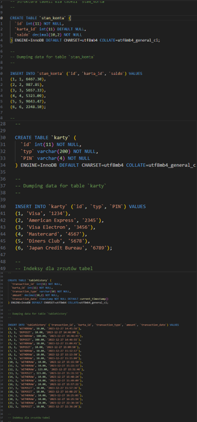

### "ATM" Program

Once these contents have been added to the database, you can start working with the "ATM" program. Starting with the class that will connect all classes using our previously created database, the class responsible for this is "DatabaseConnector". The "DatabaseConnector" class serves as a central point for establishing a connection with the database. It is an exemplary design pattern used in Java applications to isolate database connection details from the rest of the application.

#### Description of the DatabaseConnector Class's Operation

The class defines three constants - `DATABASE_URL`, `DATABASE_USER`, and `DATABASE_PASSWORD`. These constants store the information necessary to connect to the database, including the URL (database address), username, and password. In this class, they are set to specific values that indicate a local MySQL database (`jdbc:mysql://localhost:3306/atm`).

#### The connect() Method

`connect()` is the main method in the "DatabaseConnector" class, used to establish a connection with the database. Here's what happens during its invocation:

- Loading the Driver: Java requires loading the appropriate database driver before establishing a connection. In newer versions of JDBC, the driver loads automatically, so this step can often be skipped.

- Establishing a Connection: The method `DriverManager.getConnection()` is used with previously defined constants `DATABASE_URL`, `DATABASE_USER`, and `DATABASE_PASSWORD` to create and return a Connection object. This Connection object is later used by other parts of the application to send SQL queries and manage transactions with the database.

- Exception Handling: In case of connection issues (e.g., incorrect login details, the database not running, etc.), the method throws a `RuntimeException` with an appropriate error message. This allows the calling code to handle the connection problem appropriately.

#### Usage

The "DatabaseConnector" class is typically used throughout the application to obtain a connection with the database. For example, other classes that need to execute an SQL query can first call `DatabaseConnector.connect()` to obtain a Connection object, and then use this object to execute the query.

#### Summary

"DatabaseConnector" is an essential part of the application, allowing for abstraction and centralization of database connection management. By isolating connection details and the way to obtain a connection, this class provides flexibility (ease of changing databases, connection parameters, etc.) and code cleanliness, reducing code repetition and centralizing database handling in one place.

### The Main Class "Main"

The "Main" class serves as the main entry point to the application. It uses the connection with the database through the "DatabaseConnector" class to retrieve information about cards (id, type, PIN) from the cards table. This is done in a try-with-resources block, which ensures automatic closure of resources after the operation is completed. After retrieving the data, the application displays the working directory path and launches the user interface Dashboard, which is likely a control panel or management screen.

This class primarily focuses on two aspects:

- Connecting to the database and retrieving data: It uses SQL queries to retrieve data from the cards table in the database and processes these data in the context of the application.

- Launching the user interface: After retrieving the data and handling database operations, the program initiates and displays the user interface (Dashboard), which serves as the main application window.

### The Class "MainRandomPassword"

"MainRandomPassword" is an alternative version of the Main class that generates random PIN numbers for different types of cards and updates them in the database. This can be useful for resetting or initializing PIN data in the system. Here are the key aspects of this class's operation:

#### Connecting to the Database

Like Main, it connects to the database using `DatabaseConnector`.

#### Generating Random PINs

It uses the `Random` class to generate random PIN numbers for defined types of cards.

#### Updating the Database

For each type of card, the class updates the PIN number in the database using the randomly generated numbers. The function "updateCardPin" is responsible for updating the PIN in the database.

#### Differences Between Main and MainRandomPassword

While Main is used for retrieving data from the database and launching the UI, MainRandomPassword has a specific application in generating and updating random PIN numbers for cards. It can be assumed that MainRandomPassword is an administrative tool or part of the system initialization process, where it is necessary to ensure that all cards have set PINs, perhaps before the system is launched or as part of regular security procedures.

#### Why MainRandomPassword Exists

"MainRandomPassword" exists as a separate functionality for resetting or initializing card PINs in the system. It can be used for mass

setting or resetting PINs, which is useful in various administrative scenarios, such as initial system launch, periodic resetting for security, or when an organization decides to change the PIN scheme for its cards. It is an example of how an application can include auxiliary or administrative tools in addition to its main functionality.

### User Interface Dashboard

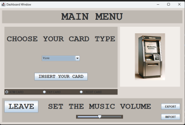

- **'MAIN MENU' Header**: The screen title, informing the user that they are in the main menu of the application.

- **'CHOOSE YOUR CARD TYPE' Selection Box**: A ComboBox that allows the user to select the type of card (e.g., Visa, Mastercard, etc.) they wish to interact with.

- **'INSERT YOUR CARD' Button**: A button that the user can use to "insert" the selected card, likely initiating a verification process or transaction.

- **Radio Buttons for Card Type**: A group of radio buttons allowing the user to choose the kind of card (ATM CARD, PAY CARD, CREDIT CARD) which may change the options or processes available depending on the selection.

- **'LEAVE' Button**: Allows the user to exit the application.

- **'SET THE MUSIC VOLUME' Volume Adjustment**: A slider for adjusting the volume of sounds in the application, which may pertain to audio signals issued by the application during various actions.

- **'EXPORT' and 'IMPORT' Buttons**: Allow for exporting data to a CSV file and importing data from a CSV file.

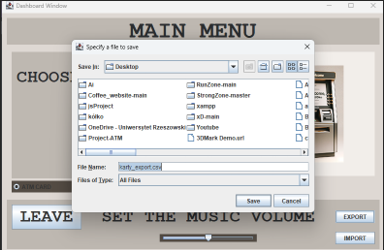

- **File Selection Screens**: Appear after clicking the 'EXPORT' or 'IMPORT' buttons. They allow the user to choose the location to which to export data or from which to import data.

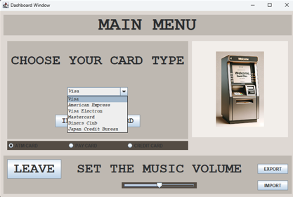

- **Extended Dropdown List**: Displays all available card types that the user can select. In this case, it shows various types of payment cards, such as Visa, American Express, Visa Electron, Mastercard, Diners Club, Japan Credit Bureau.

- **Functionality**: When the user selects a card type and clicks 'INSERT YOUR CARD', the application may proceed to the next stage, which might require entering a PIN or performing another action.

- **'EXPORT' and 'IMPORT' Buttons**: Used to manage application data. 'EXPORT' allows saving data to a CSV file, which can be used for creating backups or transferring data between systems. 'IMPORT' enables loading data from a CSV file, useful for restoring data or updating the system with new information.

- **Application Sounds**: The ability to adjust the volume indicates that the application includes multimedia elements, such as sounds, that may be played during various actions, for example, when a card is accepted or rejected, or during cash withdrawal.

Overall: The Dashboard is designed to enable easy interaction with the system and manage payment cards and transactions. All these elements are designed with intuitiveness in mind, so that the user can quickly and effectively use the functions offered by the system.

### PinWindow - PIN Entry Interface

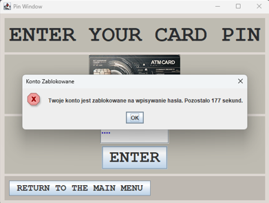

- **"ENTER YOUR CARD PIN" Header**: Informs the user that they should enter their PIN here.

- **PIN Entry Text Field**: Where the user enters their PIN. Typically, entered digits are obscured by asterisks or dots for security.

- **"ENTER" Button**: After entering the PIN, the user presses this button to submit and process the information.

- **"RETURN TO THE MAIN MENU" Button**: Allows the user to return to the main menu without entering a PIN.

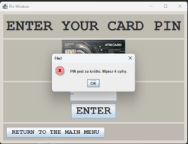

- **PIN Validation**: The entered PIN is validated using defined rules. If the PIN is too short (less than 4 digits), the user receives an error message informing them of the incorrect PIN length.

- **Account Lock**: If the user enters the wrong PIN several times in a row, the account is locked for a specific time, signaled by an appropriate message with a countdown of seconds remaining until unlocking.

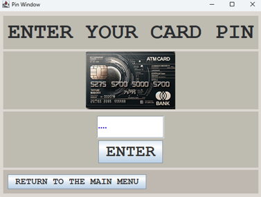

- **Event Handling**: Handling the "ENTER" Button: Upon clicking this button, the code processes the entered PIN and compares it to the PIN stored in the database. If the PIN is correct, the user may proceed; if not, an error message may be displayed, or the account may be locked.

- **Return to the Main Menu**: The "RETURN TO THE MAIN MENU" button allows the user to cancel the process and return to the previous interface.

- **Error Messages**: One of the pictures shows a message about a locked account, indicating that the system has implemented a security mechanism that locks access after several failed PIN entry attempts. Another picture shows a message stating that the PIN is too short, suggesting that the system expects a four-digit code.

- **Backend (Code)**: In the code, the PinWindow class is responsible for creating and managing this window. It uses the checkPin method to verify the entered PIN. The system counts failed PIN entry attempts and can lock the account for a specific time (lockout

EndTime), as shown in one of the messages. In case of correct PIN entry, the application likely proceeds to the next window or performs the next action, which is not visible in the submitted code.

Overall Analysis: PinWindow is a crucial element of the banking application, ensuring secure access to the user's account. PIN code verification, error handling, and account locking after failed attempts are standard practices in applications requiring authorization. The interface is simple and straightforward, minimizing the risk of user errors and enhancing security.

### MenuWindow - Banking Operations Center

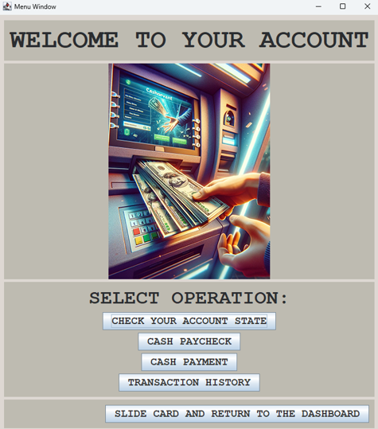

- **"WELCOME TO YOUR ACCOUNT" Header**: Welcomes the user and confirms successful authorization.

- **"SELECT OPERATION" Section**: A list of options the user can select from:

  - CHECK YOUR ACCOUNT STATE: Allows the user to check the current state of their account, such as the balance.

  - CASH PAYCHECK: A function that enables the user to withdraw funds from their account.

  - CASH PAYMENT: Used for depositing money into the account or making payments.

  - TRANSACTION HISTORY: Review of the transaction history conducted through the account.

- **"SLIDE CARD AND RETURN TO THE DASHBOARD" Button**: Allows the user to quickly return to the main menu of the application.

**Code and Its Functionality:**

In the code, the MenuWindow class is responsible for displaying and managing this window. It includes the logic for initializing and handling user interactions:

- **Function Buttons**: Each button corresponds to initiating a specific operation. Clicking any of them may lead to opening a new window with the relevant function, e.g., checking the account balance, making a withdrawal, making a deposit, or viewing transaction history.

- **Returning to the Dashboard**: The "RETURN TO THE MAIN MENU" button ends the MenuWindow session and restores the Dashboard, which can be achieved by closing the current window and opening a new window of the Dashboard class.

- **Dialogs and Actions**: The application implements dialogs confirming user actions or displaying error messages, which however are not shown on the provided screenshot. Button actions are handled by ActionListener, which responds to clicks and performs specified methods, such as dispose() to close the current window and setVisible(true) to display a new window.

**Overall Analysis:**

MenuWindow is designed to be a user-friendly account management center that provides easy access to basic banking functions. The next steps after selecting an option are likely implemented in other classes and windows that were part of the submitted code, such as BalanceWindow, PaycheckWindow, PaymentWindows, and HistoryWindow, corresponding to the detailed handling of each operation.

### BalanceWindow - Account Balance Display

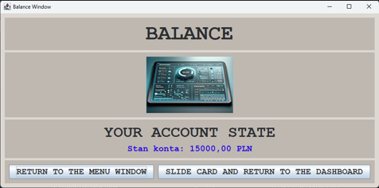

- **"BALANCE" Header**: Clearly informs the user that they are in the account balance section.

- **"YOUR ACCOUNT STATE" Account Status Information**: Displays the current account balance of the user. In the submitted picture, the balance is "15000,00 PLN", but for each card, this is a value retrieved from the database.

- **"RETURN TO THE MENU WINDOW" Button**: Allows the user to return to the previous menu (MenuWindow) to choose other options.

- **"SLIDE CARD AND RETURN TO THE DASHBOARD" Button**: Enables exit from the current view and return to the main menu of the application (Dashboard).

**Code and Its Functionality:**

In the code, the BalanceWindow class is responsible for displaying and managing this window. It uses a connection to the database to retrieve and display the current account balance of the user:

- **Retrieving the Balance**: In the showBalance() method, BalanceWindow connects to the database using DatabaseConnector.connect(). Then, a SQL query is executed that retrieves the account balance associated with the specific card identifier of the user.

- **Button Event Handling**: Buttons in the window handle actions such as closing the BalanceWindow and opening the MenuWindow or Dashboard through methods dispose() and setVisible(true). This allows the user to navigate easily between different parts of the application.

**Overall Analysis:**

BalanceWindow is a simple and intuitive tool that provides users with quick and easy access to information about the status of their financial resources. It is a key feature in banking applications, allowing for ongoing monitoring of financial resources, essential for managing personal finances.

### PaycheckWindow - Withdrawal of Funds

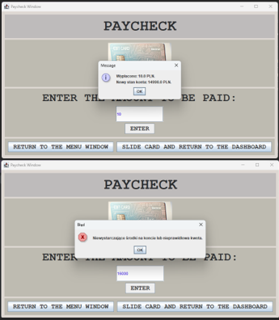

- **Description**: This window is used for withdrawing funds from the user's account. This functionality is visible in the code in the PaycheckWindow class, where the user enters the amount they wish to withdraw and then confirms the operation with the "ENTER" button.

- **Functionality**:

  - Text Field: Where the user can enter the withdrawal amount.
  - "ENTER" Button: Used to confirm the entered amount and initiate the withdrawal operation.
  - Navigation Buttons: Allow the user to return to the main menu ("RETURN TO THE MENU WINDOW") or the main application screen ("SLIDE CARD AND RETURN TO THE DASHBOARD").

- \*\*Code

and Its Functionality\*\*:

- The PaycheckWindow class uses methods such as withdrawMoney() to process the withdrawal of funds.
- It checks if the entered amount is valid and if the account balance allows for the transaction.
- It updates the account balance in the database using SQL queries.
- It records the transaction in the account history.
- It displays an appropriate message with the operation outcome.

- **Validation and Security**:
  - The code contains validation mechanisms for the entered data and security measures to prevent exceeding available funds.
  - In case of validation errors, the user receives messages informing them of the error and allowing them to correct the action.

### PaymentWindow - Deposit of Funds

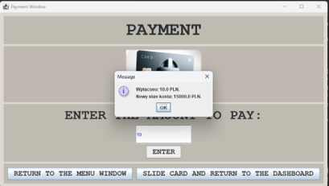

- **Description**: The "PaymentWindow" operates similarly to PaycheckWindow but is used for depositing money into the user's account. The user enters the amount to deposit and confirms the operation.

- **Functionality**:

  - Text Field: Where the user can enter the deposit amount.
  - "ENTER" Button: Used to confirm the entered amount and initiate the deposit operation.
  - Navigation Buttons: Allow the user to return to the main menu ("RETURN TO THE MENU WINDOW") or the main application screen ("SLIDE CARD AND RETURN TO THE DASHBOARD").

- **Code and Its Functionality**:

  - The PaymentWindow class uses methods such as depositMoney() to process the deposit of funds.
  - It checks if the entered amount is valid and if the operation can be executed.
  - It updates the account balance in the database using SQL queries.
  - It records the transaction in the account history.
  - It displays an appropriate message with the operation outcome.

- **Validation and Security**:
  - The code contains validation mechanisms for the entered data and security measures to prevent improper financial operations.
  - In case of validation errors, the user receives messages informing them of the error and allowing them to correct the action.

**Overall Analysis**:
Both dialog windows are designed in a simple and intuitive manner, facilitating easy use of banking functions without direct contact with bank personnel. This is a convenient feature in banking applications, allowing users to quickly manage their financial resources.

### HistoryWindow - Transaction History

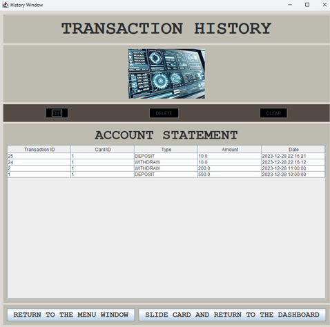

- **Description**: HistoryWindow is a window in the banking application that displays the transaction history made by the user.

- **Main Elements of HistoryWindow**:

  - "TRANSACTION HISTORY" Header: Informs the user that they are in the transaction history section.
  - "ACCOUNT STATEMENT" Table: Displays a list of transactions including transaction ID, card ID, transaction type (deposit, withdrawal), amount, and date.
  - "EDIT", "DELETE", "CLEAR" Buttons:
    - EDIT: Allows editing the selected transaction.
    - DELETE: Allows deleting the selected transaction from the history.
    - CLEAR: Clears selected rows in the table.
  - Navigation Buttons:
    - RETURN TO THE MENU WINDOW: Allows the user to return to the main operation menu (MenuWindow).
    - SLIDE CARD AND RETURN TO THE DASHBOARD: Enables exit from the current view and return to the main application menu (Dashboard).

- **Code and Its Functionality**: In the code, the HistoryWindow class is responsible for displaying the user's transaction history. It uses a connection to the database to retrieve the transaction history and displays it in a table. The functionality of this class includes:

  - Loading transaction history: The loadTransactionHistory() method retrieves and displays transactions from the database.
  - Editing and deleting transactions: The "EDIT" and "DELETE" buttons are connected to functions that allow for modifying and deleting records from the table. Deleting a record is also reflected in the database.
  - Clearing data: The "CLEAR" button allows for clearing data from the table, but not necessarily from the database.

- **Validation and Security**: The code includes validation and security mechanisms to ensure that editing and deleting operations are correctly performed and that the user has the appropriate permissions to perform these actions.

- **User Interactions**: The "EDIT", "DELETE", and "CLEAR" buttons in the table may invoke dialog boxes or additional forms where the user can edit or confirm their actions.

- **Overall Analysis**:
  - HistoryWindow allows the user to review and manage their transaction history, which is a key function for banking applications.
  - The user has access to their financial activity, allowing for better financial management.
  - The code behind this window provides the necessary functions for database interaction, user interface event handling, and data presentation in a clear and accessible manner.

### SUMMARY

The entire program, described through various user interface windows and corresponding code, is a comprehensive banking account management system, likely intended for ATMs or online banking applications.

- **Main Functions**:
  - **User Authentication**: The system starts with user authentication using the PinWindow, where the user must enter their PIN code to access their account.
  - **Dashboard**: After successful

login, the user is directed to the Dashboard, which serves as a navigation hub, offering various options such as viewing the balance, making withdrawals, making deposits, and viewing transaction history.

- **Account Operations**:
  - **BalanceWindow**: Allows the user to check the current balance of their account.
  - **PaycheckWindow**: Enables the withdrawal of a specified amount from the account, with appropriate validations to prevent overdrawing.
  - **PaymentWindow**: Allows for the deposit of money into the user's account.
  - **HistoryWindow**: Presents the user with their transaction history, providing insight into account activity and enabling transaction management.
- **Data Management**:

  - Export and import of data in CSV format, allowing for backup and data transfer between systems.
  - Editing and deleting records in the transaction history, facilitating order and precise tracking of financial activity.

- **Security and Validation**: The program includes a range of security mechanisms, including account locking after several failed PIN entry attempts, transaction amount validation to avoid excessive indebtedness, and confirmations and error messages that inform the user of the operation status.

- **User and Interface**: The user interface is designed to be simple and intuitive, allowing the user to easily perform the needed financial operations without advanced technical knowledge.

The program as a whole constitutes a complete banking account management system that integrates key functions required for modern banking applications. It provides the user with control over their finances through easy-to-use tools for monitoring and managing their funds and transaction history. It is an example of well-integrated software that focuses on the user and their needs, ensuring security and trust in financial operations conducted.

# 6. Summary

Development of a GUI application: An advanced application with a graphical user interface was created, simulating the operation of a real ATM. The interface was designed to be intuitive and easy to use, allowing users to perform various banking operations in a way that mirrors real ATM experiences.

Use of Java Swing and MySQL: The application was built using the Java Swing environment, ensuring stability and efficiency. The use of MySQL for database management guarantees the security and integrity of data, which is crucial in simulating banking operations.

Implementation of banking functions: Basic ATM functions such as PIN verification, balance checking, cash withdrawal and deposit, and viewing transaction history were implemented. These functions provide a realistic ATM usage experience, essential for training and educating bank employees.

Additional features for the user: Unique features such as volume adjustment and database data export/import were introduced, increasing the application's functionality and improving the user experience.

Planned functional development: The project plans to extend functionalities to include new banking options and security improvements. There is also a plan to enhance the user interface to make it even more intuitive and accessible.

Integration with banking systems and testing: Integration with additional banking systems is planned, allowing for broader application use in a real banking environment. The expansion of testing capabilities will better prepare for real ATM operation scenarios.

Advanced encryption techniques and security measures: To protect user data, the implementation of advanced encryption techniques and security measures is planned, which is key in the context of financial and personal information protection.

## 6.1. Further planned project development work includes:

1. Integration with mobile payment systems: Expanding ATM functionalities to support contactless and mobile payments, increasing accessibility and convenience for users.

2. Application of machine learning for risk profiling: Implementing machine learning algorithms to detect suspicious transactions and prevent fraud.

3. User interface enhancement: Modernizing the UI/UX to be more intuitive and user-friendly, potentially incorporating touch technology and graphical elements.

4. Introduction of customization features: Allowing users to personalize the ATM interface according to individual preferences, e.g., language selection or screen appearance.

5. Increasing interactivity: Adding interactive tutorials to help new users learn how to use the ATM.

6. Cybersecurity enhancement: Strengthening security measures by introducing modern cryptographic solutions and multi-factor authentication.

7. Expansion to new markets: Adapting the software to meet the requirements and specifications of different countries and financial institutions, allowing for global system deployment.

8. Implementation of updates: Regular software updates to introduce new features and maintain compatibility with the latest industry standards.

Each of these points can be further developed, considering specific requirements and goals of the project.

# 7. Literature

To deepen knowledge about ATM systems and transactional systems in general, the following sources can be referred to:

## 7.1. Books and Textbooks

1. "Bank 3.0: Why Banking Is No Longer Somewhere You Go But Something You Do" - Brett King. This book provides insights into technological changes in banking and the future of financial transactions.

2. "The ATM and the Internet of Things" - Richard P. Smyth. This work discusses the development of ATMs in the context of the growing network of Internet-connected devices.

3. "Designing the Digital Experience: How to Use EXPERIENCE DESIGN Tools & Techniques to Build Websites Customers Love" - David Lee King. This book is useful for understanding how to design user-friendly interfaces for banking applications

.

## 7.2. Articles

1. "How ATMs Work" - An article in "How Stuff Works" magazine that explains the functioning of ATMs in detail.

2. "The Evolution of Automated Teller Machines" - A scientific article discussing the history and development of ATMs.

## 7.3. Links to Websites

1. [Official Documentation of Java Platform, Standard Ed.](https://docs.oracle.com/javase/8/docs/api/) - The Java SE documentation provides information about using Java, which is often used to create ATM software.

2. [Stack Overflow](https://stackoverflow.blog) - A community of developers where you can find answers to many programming-related questions, including those related to creating banking software.

3. [GitHub](https://github.com/) - This platform can find open-source projects related to ATM systems, which can serve as examples or starting points for your own projects.

Using these sources significantly enriched my knowledge about ATM systems, their security, user interface, and best practices in creating software in this field.
